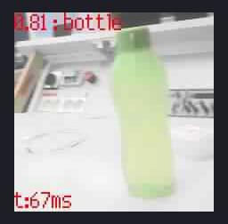

# Image Classification
Image classification predicts which class an image represents. You can use the same pictures here of your object in object detection but you will need images of another class (another object or just images without the object). This model knows the classes "bottle" and "no bottle". You can also test this model with the test images.

## Demo 



## Steps
1. Gather data
	- Take images of your classes
		- Atleast 50 images of each class, the more the better (I had around 400 of bottle and 400 of no bottle)

2. Preprocess data
	- Resize images for smaller size and rename if you want
	- Split images to training and validation images if you want
		- The split can be done when training too
		- Validation images 10-20% of your training images

3. Training the model
	- a) Train with [Maixhub](https://maixhub.com)
		- You need an account for Maixhub and you can find instruction there
		- Make a new Training project for image classification, create a new dataset and add images and label (limit 50-3000 images)
		- Create Task, Select Model nncase, you can add image augmentation with Mirror, Rotation and Blur
		- Create the Training Task, after training you can check results and Deploy model
		- Download the model manually and unzip
	- b) Train with Tensorflow Keras and convert tflite model to kmodel with nncase
		- Documentation here: https://keras.io/getting_started/intro_to_keras_for_engineers/
		- Code Examples: Image Classification from Scratch (2-class) and Simple MNIST convnet (multiclass) are good examples to follow
		- Convert the model to tflite and save

			```python
			# Convert to TFLite
			converter = tf.lite.TFLiteConverter.from_keras_model(model)
			tflite_model = converter.convert()

			# Save the model
			with open('handmodel_v2.tflite', 'wb') as f:
				f.write(tflite_model)```

		- Convert tflite model to kmodel with nncase
		- You can use Maix_Toolbox: https://github.com/sipeed/Maix_Toolbox
		- Or use https://github.com/kendryte/nncase and follow instructions there (Usage, FAQ, Examples eg. 20classes_yolo)
		- Note limitations: https://github.com/kendryte/nncase/blob/master/docs/FAQ_EN.md
		- Get Maix_Toolbox by git clone
		- Fix bug in Maix_Toolbox (change gz to xz)

			```shell
			nano get_nncase.sh
			​
			//inside the get_nncase.sh
			...
			...
			tar -Jxf ncc-linux-x86_64.tar.xz
			rm ncc-linux-x86_64.tar.xz
			...
			//end of file```

		- Download the library

			```shell
			./get_nncase.sh
			```

		- Put some images in images/ folder for inference, has to be same resolution as input resolution of model
		- Place the model in Maix_Toolbox folder and convert it to .kmodel using

			```shell
			/tflite2kmodel.sh example.tflite
			```

		- I didn't get this working as I got an error

			```shell
			Fatal: Nullable object must have a value.
			```
	- c) There is also a [local training method](https://wiki.sipeed.com/soft/maixpy/en/course/ai/train/local.html) for Linux.

4. Using the model
	- If you downloaded the model from Maixhub, you also get main.py program to test out your model
	- In main.py, change model_address to 0x300000 if you're not using SD
	- Use kflash_gui to upload minimum firmware (with IDE support) and flash the model to 0x300000
	- Use MaixPy to connect to Maixduino and run main.py

## Issues
- Freezes sometimes, could be a memory issue
- Sometimes get "ValueError: input not support"
