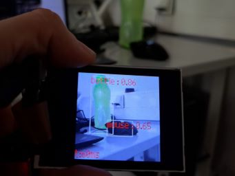

# Object Detection with Two Objects

At the end I wanted to try adding another object so the model could detect two objects. I did not take as many pictures of the object (computer mouse) so the accuracy for the mouse is not as good and it isn't recognized very well. But I didn't really want to use much time to take and process more pictures.

## Demo

## MouseOnly

I also tried making a model only for the mouse, which is in the OnlyMouse folder. At first training the model failed, maybe because there weren't so many pictures. I took some more but the accuracy of the model was not good. I ended up using duplicate pictures + image augmentation so the accuracy ended up a lot better but it's not actually that good because it was not validated against images taken by the device. So it's good practice to use images from the device as validation set.