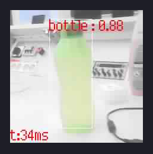

# Object Detection
Here I created a model for detecting one object and locating it. You can create your own model by following the instructions or test this model for detecting a green bottle with testing images.

## Demo 

## Steps

1. Gather data
    - Take images of your object
      - Atleast 50 images, the more the better

2. Preprocess data
    - Resize images for smaller size
        - 224x224px is good but not necessary, you can have different resolution and resize before training
    - Rename pictures if you want
    - Split images to training and validation images if you want
        - The split can be done when training too
        - Validation images 10-20% of your training images
            - (I had 1010 training and 200 validation images)
    - Annotate images with an image annotation tool
        - For example: VoTT
        - Export annotations as xml (Pascal VoC format)
            - If you're using a different architecture, you might need to use another format (eg. JSON)

3. Training the model
    - Train with [Maixhub](https://maixhub.com)
        - You need an account for Maixhub and you can find instruction there
        - Make a new Training project for image detection, create a new dataset and add images (limit 50-3000 images)
        - You can also annotate images in Maixhub but you can't extract the annotations
        - Create Task, Select Model nncase, you can add image augmentation with Mirror, Rotation and Blur
        - Create the Training Task, after training you can check results and Deploy model
        - Download the model manually and unzip

4. Using the model
    - If you downloaded the model from Maixhub, you also get main.py program to test out your model
    - In main.py, change model_address to 0x300000 if you're not using SD
    - Use kflash_gui to upload minimum firmware (with IDE support) and flash the model to 0x300000
    - Use MaixPy to connect to Maixduino and run main.py
    - If you're using this model, you can test it on the validation images

## Issues
- Freezes sometimes, could be a memory issue
- Sometimes get "TypeError: Can't convert to type"
